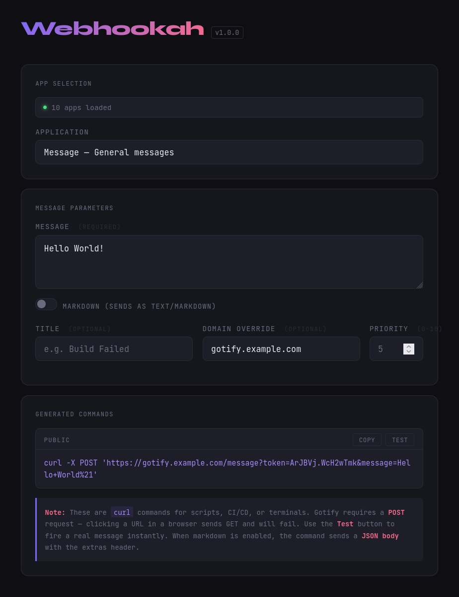

# Webhookah

> A Gotify plugin for building and testing webhook `curl` commands — with markdown support, domain overrides, and a UI that doesn't make you cry.



---

## Why?

Gotify already lets you send per app messages via its interface. But generating the right `curl` command every time - remembering the app token, escaping the message, adding the right headers for markdown — is tedious.

Webhookah gives you a proper builder UI inside your Gotify instance:

- Picks up your apps automatically (no manual token pasting)
- Generates a ready-to-copy `curl` command
- Supports **markdown messages** via Gotify's `extras` API (sent as JSON body, which is the only way it seems works)
- Optional **domain override** for when your internal and external addresses differ
- **Test button** that fires the message instantly from the browser
- Remembers your last values across sessions

---

## Installation

1. Go to the [Releases](https://github.com/barina/gotify-webhookah/releases) page
2. Download the `.so` file matching your Gotify server's architecture and version, e.g.:
   ```
   webhookah-linux-amd64-for-gotify-v2.9.0.so
   ```
3. Copy it to your Gotify plugins directory (default: `./data/plugins/`)
4. Restart Gotify
5. In the Gotify web UI, go to **Plugins**, find **Webhookah**, and click **Enable**
6. Click the **Open Webhook Builder** link in the plugin's display panel

> **Note:** The `.so` file must match the exact Go version and architecture Gotify was built with. If you're unsure, check your Gotify server's version and pick the matching release file.

---

## Building from Source

Requirements: Go, Docker, Make

```bash
git clone https://github.com/barina/gotify-webhookah
cd gotify-webhookah

# Install gomod-cap (once)
go install github.com/gotify/plugin-api/cmd/gomod-cap@latest
export PATH=$PATH:$(go env GOPATH)/bin

# Build for all architectures
make GOTIFY_VERSION="v2.9.0" FILE_SUFFIX="-for-gotify-v2.9.0" build
```

Output `.so` files will be in the `./build/` directory.

To build for a specific architecture only:

```bash
make GOTIFY_VERSION="v2.9.0" FILE_SUFFIX="-for-gotify-v2.9.0" build-linux-amd64
```

> Docker is required for cross-compilation. Make sure your user is in the `docker` group (`sudo usermod -aG docker $USER`) so you don't need to run `make` as root.

### Plugin configuration (optional)

After enabling the plugin, you can configure it via the **Settings** button in the plugin panel:

| Field | Description |
|---|---|
| `public_domain` | Override the public-facing domain in generated URLs (e.g. `gotify.example.com`) |
| `local_ip` | Local IP for generating a second "local network" curl command |
| `local_port` | Port for the local URL (default: `80`) |

---

## Usage

1. Open the builder via the link in the Webhookah plugin panel
2. Select an app from the dropdown
3. Fill in your message (required), title, and priority as needed
4. Toggle **Markdown** on if your message contains markdown syntax — this switches the output to a JSON-body curl command with the correct `extras` header that Gotify requires for markdown rendering
5. Copy the generated command or hit **Test** to send immediately

---

## Disclaimer

This plugin is provided as-is under the MIT license. It is not affiliated with or endorsed by the Gotify project.

The plugin reads your Gotify session token from `localStorage` to fetch your app list — this happens entirely within your browser and your own Gotify instance. No data is sent anywhere else.

Use at your own risk. The author takes no responsibility for misconfigured webhooks, flooded notification channels, or CI pipelines that page you at 3am.

---

## License

[MIT](LICENSE) © [Roy Barina](https://github.com/barina)